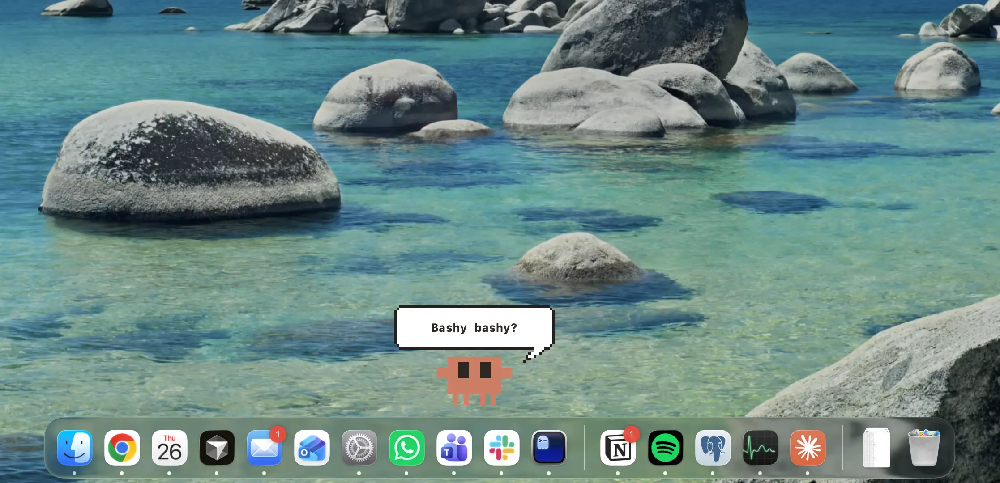

# Clawy

A pixel-art desktop pet for macOS that reacts to your [Claude Code](https://docs.anthropic.com/en/docs/claude-code) sessions.

<p align="center">
  
</p>

Clawy sits on top of your Dock, shows cute thought bubbles when Claude asks for permission, and walks around when idle.

### Demo

https://github.com/user-attachments/assets/880bcb68-a415-467f-9703-b18f7270084b


## Features

- **Pixel art sprite** with idle, wave, walk, think, and alert animations
- **Thought bubbles** with cute messages when Claude needs permission ("Gitty gitty?", "Delete-y delete-y?", "Pippy pippy?")
- **Claude Code hooks** auto-installed on launch, removed on quit
- **Click to focus** the terminal running Claude Code
- **Drag** to reposition along the Dock
- **Idle walking** — Clawy wanders to random spots when bored
- **Configurable size** (S/M/L) from the menu bar
- **Multi-monitor support** — finds the screen with the Dock
- **Persistent position** — remembers where you left him

## Install

### Download

Grab `Clawy.zip` from [Releases](../../releases), unzip, and drag `Clawy.app` to `/Applications`.

> **"App is damaged and can't be opened"?** Run this in Terminal after unzipping:
> ```bash
> xattr -cr /Applications/Clawy.app
> ```

### Build from source

Requires Xcode Command Line Tools and macOS 13+.

```bash
git clone https://github.com/danmana/clawy.git
cd clawy
./scripts/build-app.sh
open dist/Clawy.app
```

## Usage

- **Left-click** — wave + focus the Claude Code terminal
- **Drag** — reposition horizontally along the Dock
- **Right-click** — context menu (wave, walk, think, quit)
- **Menu bar** (paw icon) — size, idle walk toggle, test bubbles, reset position, quit

## Configuration

Config is stored at `~/.clawy/config.json`:

```json
{
  "idle_walk": true,
  "size": "M",
  "last_x": 850.0
}
```

| Key | Values | Description |
|-----|--------|-------------|
| `idle_walk` | `true` / `false` | Clawy walks to random spots when idle |
| `size` | `"S"` / `"M"` / `"L"` | Pet size (Small 72px, Medium 108px, Large 144px) |
| `last_x` | number | Saved horizontal position (auto-updated) |

## How it works

Clawy uses [Claude Code hooks](https://docs.anthropic.com/en/docs/claude-code/hooks) to react to events:

| Event | Reaction |
|-------|----------|
| `PreToolUse` (Bash) | Thought bubble with cute message |
| `PreToolUse` (WebFetch) | "Fetchy fetchy?" bubble |
| `PostToolUse` | Back to idle |
| `UserPromptSubmit` | Thinking animation |
| `Stop` | Wave animation |

Hooks are automatically added to `~/.claude/settings.json` on launch and removed on quit.

## Thought bubble messages

| Command | Message |
|---------|---------|
| `rm` / `rmdir` | "Trashy trashy?" |
| `git` | "Gitty gitty?" |
| `npm` / `pnpm` | "Packy packy?" |
| `yarn` | "Yarny yarny?" |
| `bun` | "Bunny bunny?" |
| `pip` | "Pippy pippy?" |
| `python` | "Snakey snakey?" |
| `node` | "Nodey nodey?" |
| `curl` / `wget` | "Fetchy fetchy?" |
| `docker` | "Docky docky?" |
| `sudo` | "Bossy bossy?" |
| `mkdir` / `make` | "Makey makey?" |
| `chmod` | "Changy changy?" |
| `mv` | "Movey movey?" |
| `cp` | "Copey copey?" |
| `cat` | "Meowy meowy?" |
| `ps` | "Pssst pssst?" |
| `rg` | "Rippy greppy?" |
| `kill` | "Killy killy?" |
| `brew` | "Brewy brewy?" |
| `swift` | "Swifty swifty?" |
| `aws` | "Awwsy cloudy?" |
| `gcloud` | "Googly cloudy?" |
| `az` | "Zury Azury?" |
| `bq` | "Query query?" |
| `tar` / `zip` / `gzip` | "Squishy squashy?" |
| Unknown | "Can I? Can I?" |

## Requirements

- macOS 13+
- [Claude Code](https://docs.anthropic.com/en/docs/claude-code) installed

## License

MIT
